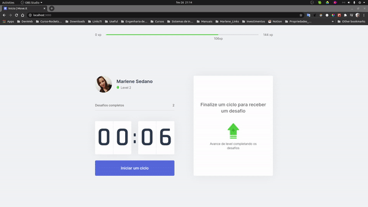

# Next Level Week 4 - Trilha React

Este projeto foi desenvolvido durante a Next Level Week 4 ministrado pela Rocketseat.

## Projeto Move-it

Atualmente passamos boa parte do nosso dia sentados e normalmente não praticamos atividades físicas. Para ajudar as pessoas a melhorarem sua rotina o Move-it permite criar pomodoros de 25 minutos com intervalos regulares para realizar desafios que lhe garantem bônus de XP.

## :rocket: Tecnologias

Este projeto foi desenvolvido com as seguintes tecnologias:

- [TypeScript][typescript]
- [React][reactjs]
- [NextJS][nextjs]

<a target="_blank" href="https://www.typescriptlang.org/">
  
</a>
<a target="_blank" href="https://reactjs.org/">
  
</a>
<a target="_blank" href="https://nextjs.org/">
  
</a>
<br>
<br>
                                                     
## Demonstração
 


## Como usar

```
# Clone este repositório
$ git clone https://github.com/marlenesedano/nlw_04_moveit

# Acessar o diretório do projeto
$ cd nlw_04_moveit

# Instalar as dependências
$ yarn install

# Iniciar a aplicação
$ yarn start

# O site vai estar disponível na porta 3000
```

